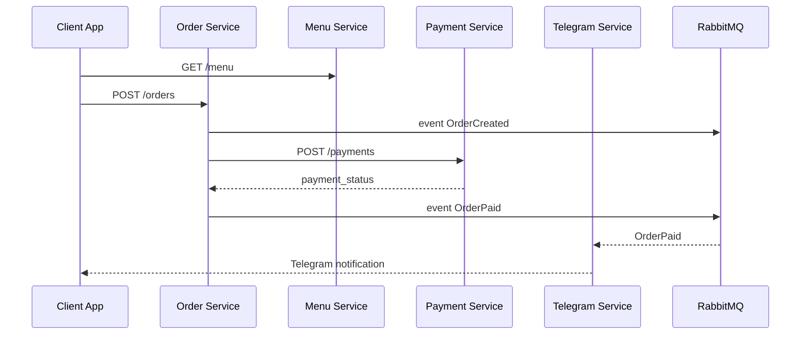

# Architecture Overview — Deliverybot_pro

## Goals
- Modular microservices with clear boundaries (DDD + Event-Driven Architecture).
- API-first with OpenAPI contracts and shared TypeScript types.
- Cloud-native (12‑Factor) with horizontal scalability.

## Architectural Decisions

### 1) Databases
- **Decision:** отдельная БД на сервис (PostgreSQL), read replicas для аналитики.
- **Why:** снижает связанность и позволяет масштабировать сервисы независимо.
- **Migrations:** TypeORM migrations (единый подход в NestJS).

### 2) Service Communication
- **Sync:** REST (public APIs) + gRPC (internal high-throughput).
- **Async:** RabbitMQ для доменных событий (OrderCreated, MenuUpdated).
- **Why:** event-driven разгружает core flow и упрощает интеграции.

### 3) Caching
- **Redis:** кэш меню и каталога (Telegram и web).
- **Invalidation:** событие `MenuUpdated` → сброс кэша.
- **Bot cache:** короткий TTL (5–10 минут).

### 4) Payments
- **Decision:** использовать внешние провайдеры (ЮKassa, CloudPayments, Stripe).
- **Refunds:** через webhooks + idempotency keys.
- **Data:** хранить токены/ссылки, не хранить карты (PCI DSS).

### 5) i18n & Time Zones
- **Decision:** мультивалютность и локализация в будущем, заложить locale/zone в профиле организации.
- **Analytics:** хранить timestamps в UTC, отображать в timezone организации.

### 6) Scaling & DR
- **Scaling:** горизонтальное масштабирование сервисов.
- **Tenant isolation:** по organization_id с индексированием.
- **Backups:** PITR + ежедневные снепшоты.

---

## Microservices Map

| Service | Responsibility |
| --- | --- |
| auth-service | JWT, 2FA, OAuth2, roles |
| user-service | профили, организации, сотрудники |
| menu-service | категории, блюда, модификаторы |
| order-service | жизненный цикл заказов |
| delivery-service | зоны, расчёт доставки |
| telegram-service | магазин-бот + админ-бот |
| payment-service | провайдеры, подписки |
| analytics-service | агрегация метрик |
| notification-service | email/telegram/sms |
| integration-service | кассы и внешние API |
| loyalty-service | бонусы, промокоды |
| file-service | изображения и CDN |

---

## Data Flow (Mermaid)



---

## Example NestJS Module (Auth Service)

```ts
// services/auth-service/src/auth/auth.module.ts
import { Module } from '@nestjs/common';
import { JwtModule } from '@nestjs/jwt';
import { AuthController } from './auth.controller';
import { AuthService } from './auth.service';

@Module({
  imports: [JwtModule.register({ secret: process.env.JWT_SECRET })],
  controllers: [AuthController],
  providers: [AuthService],
})
export class AuthModule {}
```

---

## OpenAPI First
- Каждый сервис публикует OpenAPI spec.
- `packages/api-client` генерируется из контрактов.

---

## Security & Compliance
- TLS 1.3, JWT + refresh tokens, 2FA.
- OWASP Top 10 controls.
- Логи критичных действий (audit trail).
